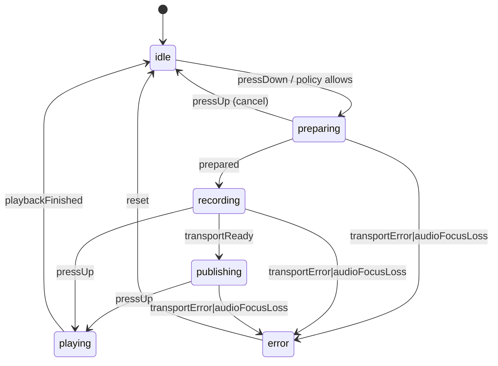

# Voyage PTT Blueprint v1.2 (2025‑12)

This document upgrades the original v1.1 blueprint into a more enterprise‑grade,
future‑proof architecture while keeping the same “no big rewrites” philosophy.
It is compatible with the current feature‑first layout described in
`docs/architecture.md`.

## Audience / Scope

- Audience: client + backend engineers shipping PTT MVP and beyond.
- Scope: PTT consent/policy/session/transport/logging boundaries.
- Out of scope: detailed UI design, group PTT, E2EE, transcription.

## Glossary (Terms Are Contract)

- `PttMode`: user‑selected global mode (`manner`, `walkie`).
- “Instant PTT”: press‑to‑talk that immediately records + attempts publish.
- “Mutual consent”: both sides explicitly allow walkie from each other.
- “Policy”: server‑driven config + platform guards that may downgrade behavior.
- “Authoritative”: server enforces; client uses for UX and early gating.

## What Changes vs v1.1

v1.1 locked four key boundaries:

- Global `PttMode` safety defaults (Manner first).
- Policy/feature flags via `PolicyConfig` + `FF` platform guards.
- A stable `VoiceTransport` port for SFU/engine swaps.
- A single `PttController` called by all UI surfaces.

v1.2 keeps those boundaries and strengthens four weak spots:

1. Mutual consent (server truth)
2. Centralized policy evaluation
3. Explicit PTT session state machine
4. Privacy‑safe logging guarantees

The goal is to ship MVP now, then scale to Kakao‑level messenger + Zello‑level
walkie without a rewrite.

## Design Invariants (Non‑Negotiable)

1. The server is the source of truth for consent/block enforcement.
2. All “can I start PTT?” decisions go through one evaluator.
3. PTT session behavior is a deterministic state machine (no implicit flags).
4. Logs are metadata‑only, enforced by code and lint.

## 1) Mutual Walkie Consent (Authoritative)

### Domain

Introduce a friendship consent model that can express:

- `allowFromMe` (my setting)
- `allowFromPeer` (peer setting)
- `allowEffective = allowFromMe && allowFromPeer`
- request timestamps for audit + UX
- block flags both directions

**Rule:** Instant PTT is allowed only when:

1. Global mode is `walkie`
2. Friendship is mutual (`allowEffective == true`)
3. Neither direction is blocked
4. Platform/OS policy allows attempt

### Explicit Consent States (Avoid “null means maybe”)

Use an explicit peer consent state to keep UX and enforcement aligned:

- `allowFromPeer`: `true | false | unknown`
- `allowEffective` is computed consistently across all clients.

MVP compatibility rule:

- If peer consent is `unknown`, treat it as `true` behind a feature flag
  (so existing behavior does not regress), but keep the mutual gate wired.

### Client Behavior

- UI toggles update only `allowFromMe`.
- `allowFromPeer` arrives from backend and may lag.
- If peer consent is unknown (MVP), treat as `true` to avoid regressions,
  but keep the mutual gate wired in code.

### Backend Contract

Provide a single endpoint/stream that returns peer consent state per friend.
All clients compute `allowEffective` the same way.

Minimum contract requirements:

- Include a per‑friend `version` (monotonic) and `updatedAt` timestamp.
- Provide idempotency for client writes (`requestId`), to avoid duplicate toggles.
- Include both‑direction block flags (server‑enforced).

Example shape (illustrative):

```json
{
  "friendId": "u_123",
  "consent": {
    "allowFromMe": true,
    "allowFromPeer": "unknown",
    "updatedAt": "2025-12-01T12:34:56Z",
    "version": 42
  },
  "block": {
    "iBlockedPeer": false,
    "peerBlockedMe": false
  }
}
```

Streaming guidance:

- Prefer one subscription per user that emits deltas (push/WebSocket/SSE).
- Events must be ordered per friend by `version`; clients ignore out‑of‑order.

### Server Enforcement Points (Avoid “Client‑Only Safety”)

To make consent truly authoritative, enforce at the server boundary where a
publish becomes possible:

- Token issuance: do not mint “can publish audio” tokens unless `allowEffective`.
- Publish authorization: reject publish attempts that violate consent/block.
- Audit trail: store consent changes with `actorUserId`, `requestId`, `updatedAt`.

## 2) Policy Engine (Single Decision Point)

v1.1 scattered “can I start PTT?” checks across notifiers/controllers.
v1.2 introduces a pure evaluator:

- Input: raw/effective policy, user global mode, mutual consent, block map,
  cooldown, platform/OS runtime info.
- Output: a `PolicyDecision` describing:
  - `effectiveMode` (may downgrade Walkie → Manner)
  - `canStart` / `blockReason`
  - derived booleans like `shouldAttemptInstantPlay`

**Non‑negotiable:** no feature or UI should re‑implement policy gates; they must
call the evaluator.

Benefits:

- Tests become trivial (pure function).
- A/B policy experiments are safe.
- iOS/Android parity is guaranteed.

### Contract: Inputs / Outputs (Make It Testable)

Evaluator input must include all sources of truth needed for a decision:

- `PolicyConfig effective` (after server JSON + platform guards)
- `PttMode userMode`
- mutual consent + block state
- cooldown / rate limits
- runtime platform info (permissions, audio focus, foreground/background constraints)
- transport readiness (optional; evaluator can expose “canAttempt” vs “willLikelyFail”)

Output should be a single `PolicyDecision` object, never ad‑hoc booleans:

- `effectiveMode` (may downgrade `walkie` → `manner`)
- `canStart` and `blockReason` (stable enum for analytics + UX strings)
- derived flags that drive behavior: `shouldAttemptInstantPlay`, `shouldStartForegroundService`, `shouldPlayBeep`,
  `audioUxProfile`, `beepProfile`, `cooldownRemainingMs`

Recommended `blockReason` codes (stable, backend‑friendly):

- `permissionDeniedMic`
- `audioFocusUnavailable`
- `backgroundRestricted`
- `modeNotWalkie`
- `consentNotMutual`
- `blockedByMe` / `blockedByPeer`
- `cooldownActive`
- `transportUnavailable`

Decision precedence (recommended, deterministic):

1. hard OS blocks (permissions, audio focus, background restrictions)
2. server blocks (mutual consent, either direction blocked)
3. mode downgrade (`walkie` → `manner`) via policy/FF
4. rate limits/cooldown
5. transport readiness (if applicable)

### Enforcement Rule

- Client uses `PolicyDecision` for UX and early exit.
- Server must still validate consent/block and reject unauthorized publishes.

## 3) PTT Session State Machine

Replace implicit “flags + async gaps” with an explicit state machine.

States:

- `idle`
- `preparing`
- `recording`
- `publishing`
- `playing`
- `error`

Events:

- `pressDown`, `pressUp`
- `policyDowngrade`, `policyBlock`
- `audioFocusLoss`, `transportError`

The state machine lives in application layer and drives:

- local record lifecycle
- transport connect/publish
- foreground service + audio focus
- UI glow/labels

**Invariant:** holding the PTT button keeps the session in
`recording/publishing`; release always transitions to `playing/idle`.

### State Machine Must Be Serializable (Single Event Queue)

Implementation guidance:

- Represent the session as `(state, context)` and process events through
  `dispatch(event)` on a single queue (no re‑entrancy).
- Side effects (start mic, connect, publish, play beep, etc.) are triggered by
  state transitions, not by UI callbacks.
- Treat “pressUp during preparing/publishing” as a first‑class event; cancel
  in‑flight work deterministically.
- Add timeouts for any async phase (`preparing`, `publishing`) to prevent “stuck”
  sessions (transition to `error`, then `idle`).

### Suggested Transition Diagram (Mermaid)



### Policy Changes Mid‑Session

If policy is downgraded or blocked while a session is active:

- `policyBlock`: immediately transition to `playing` (stop recording/publish),
  then `idle`.
- `policyDowngrade`: allow current recording to finish (optional), but prevent
  further instant sessions until decision changes (evaluator decides).

## 4) VoiceTransport v2 (Compatible Extension)

The port remains stable. v2 adds optional streams:

- `Stream<TransportState> state`
- `Stream<TransportStats> stats`

Existing implementations compile unchanged by providing default no‑op streams.

### Stream Semantics (So UI/Debug Can Trust It)

- Streams are best‑effort telemetry; never gate correctness on them.
- `state` should emit an initial value quickly (e.g., `disconnected`).
- `stats` should be throttled (e.g., 1Hz) and safe to drop.
- No‑op defaults must be “cold + empty” (no events) to preserve compatibility.

## 5) Audio UX Profiles

Move audio tuning into policy:

- Opus/VAD/DTX profile
- jitter buffer profile
- `BeepProfile` (pre‑tone length, volume)

Receiver playback always follows:

`beep → ~150ms gap → voice`

without bypassing OS silent/DND rules.

### Determinism + Parity

- Enforce the `~150ms` gap in application logic, not inside a transport SDK.
- “Respect silent/DND” means: do not play an audible cue when the OS indicates
  it should be suppressed; never route around system settings for beeps.

## 6) Privacy‑Safe Logging

Add a strict redaction layer:

- Logs only accept whitelisted metadata fields.
- Push payload raw dumps are forbidden.
- Any content field (text/body/audio transcript) must be dropped or hashed.

This is enforced in code by a redactor helper and lint rules.

### Allowed Metadata (Example)

Allowed (examples):

- `pttSessionId` (random, per session)
- `friendIdHash` (salted hash, not raw ID)
- `mode`, `effectiveMode`, `blockReason`
- `transportEngine` (e.g., livekit)
- `latencyMs` buckets, `TransportStats` buckets

Forbidden (examples):

- chat message text/body
- audio bytes, audio URLs, transcripts
- push payload raw JSON
- access tokens, phone/email, address book contents

### Enforcement Mechanics

- Provide a single API like `SafeLog.event(name, meta)` that rejects unknown keys.
- Add lint rules that forbid `print()` / ad‑hoc loggers in production codepaths.
- Add unit tests for the redactor allowlist (regression‑proof).

## 7) Modularization Path (v2+)

Current feature‑first layout is v1.2‑ready.
When the team or AI automation grows, split into internal packages:

- `packages/core`
- `packages/ptt`
- `packages/chat`

Boundaries stay identical; only paths change.

## Open Questions / Trade‑offs (Decide Explicitly)

These are “unknowns” that will otherwise become accidental implementation details.
Each item should end with an explicit decision (ADR or a short comment in this doc).

1. Consent `unknown` behavior
   - How long do we keep `unknown → true`? What triggers turning it off?
   - Which feature flag gates this (`FF.*`) and what is the rollout plan?
2. Authorization model
   - Token issuance: per friend? per conversation? global publish scope?
   - Token TTL and refresh strategy; binding to device/user/session.
   - What happens if consent changes mid‑session (server revoke semantics)?
3. Consent data delivery
   - Push vs WebSocket vs SSE vs polling: which is canonical for MVP?
   - Offline/stale handling: max tolerated staleness before blocking?
   - Delta ordering guarantees: how do we handle missed versions?
4. Rate limit / cooldown
   - Server‑side enforcement shape (per sender, per receiver, per pair).
   - Client UX: cooldown UI, backoff, and retry behavior.
5. “Respect silent/DND rules” definition
   - OS signals we trust (Android ringer mode, iOS interruption/AVAudioSession).
   - What do we do when OS state is ambiguous? (default to silent)
6. Metrics vs privacy
   - Which identifiers are allowed (hashed friendId vs session‑random only)?
   - Sampling strategy for stats in production.

## Migration Plan (No Big Rewrite)

1. Introduce `PolicyDecision` + evaluator and wire all call sites to it.
2. Add consent model + backend contract; keep `unknown → true` behind a flag.
3. Refactor `PttController` internals to drive a state machine (public API unchanged).
4. Add `SafeLog` and redaction lint gates; block raw payload dumps.
5. Add optional `VoiceTransport` state/stats streams and one debug surface to validate.

## Failure Modes & Recovery (Expected Behavior)

Define behavior upfront so implementations converge across platforms.

- Mic permission missing/denied: evaluator returns `canStart=false`, `blockReason=permissionDeniedMic`, state remains `idle`.
- Audio focus lost mid‑session: dispatch `audioFocusLoss`, transition to `playing` (stop record/publish), then `idle`.
- Token expired / auth failed: dispatch `transportError`, transition to `error`, then `idle` after reset/backoff.
- Server rejects publish (consent/block): dispatch `policyBlock` (or mapped transport error), transition to `playing`, then `idle`.
- Network drop during `publishing`: transition to `error`, then `idle`; do not auto‑reconnect if the user has released.
- “Stuck” async phase (prepare/publish): timeout → `error` → `idle` (never stuck glowing).

## Observability (Privacy‑Safe)

We need enough telemetry to debug audio issues without logging content.

Recommended events (metadata‑only, allowlisted):

- `ptt_policy_decision` (`canStart`, `blockReason`, `effectiveMode`, platform info buckets)
- `ptt_session_transition` (`fromState`, `toState`, `reason`)
- `ptt_transport_state` (`TransportState`, engine name, reconnect attempts)
- `ptt_publish_result` (`ok|rejected|error`, error category)
- `ptt_latency` (bucketed timings: press→record, press→publish, publish→firstAudio)

Suggested SLOs (initial targets, tune later):

- Press‑to‑record start p95: ≤ 200ms (warm path)
- Press‑to‑publish attempt p95: ≤ 800ms (network dependent)
- Session stuck rate: ~0 (timeouts handle it)

## Security / Abuse (MVP Guardrails)

- Server enforces consent/block at publish boundary (never client‑only).
- Rate limit PTT attempts and publishes (prevent spam/abuse).
- Bind publish capability to short‑lived tokens; do not grant broad publish scope.
- Avoid replay: tokens are time‑bound; consider nonce/session binding if needed.
- Audit consent changes (`actorUserId`, `requestId`, `updatedAt`) for abuse investigation.

## Rollout Strategy (No Regressions)

- Gate new behavior with feature flags:
  - Mutual consent gate on/off
  - `unknownPeerConsentAllows` on/off
  - Policy evaluator v2 on/off
  - SafeLog enforcement strictness (warn → block)
- Rollout sequence:
  1. Ship evaluator + SafeLog in “shadow mode” (compute + log decision, don’t block).
  2. Enable mutual gate for internal users, then % rollout.
  3. Turn off `unknown → true` only after backend consent is reliable and adoption is high.

## Testing Strategy (Cheap, High‑Value)

- Policy evaluator: unit tests for every `blockReason` and precedence ordering.
- State machine: unit tests for pressDown/pressUp races, timeouts, audioFocusLoss, transportError.
- SafeLog: tests that unknown keys are rejected and forbidden fields never pass.

## Success Criteria

- v1 ship: 1:1 Walkie/Manner, safe defaults, no privacy leaks.
- v2 expand: group/PTT framework/E2E without touching UI or app shell.
- Policy/engine swaps require only:
  - changing `PolicyConfig` JSON and evaluator rules
  - swapping `VoiceTransport` implementation
